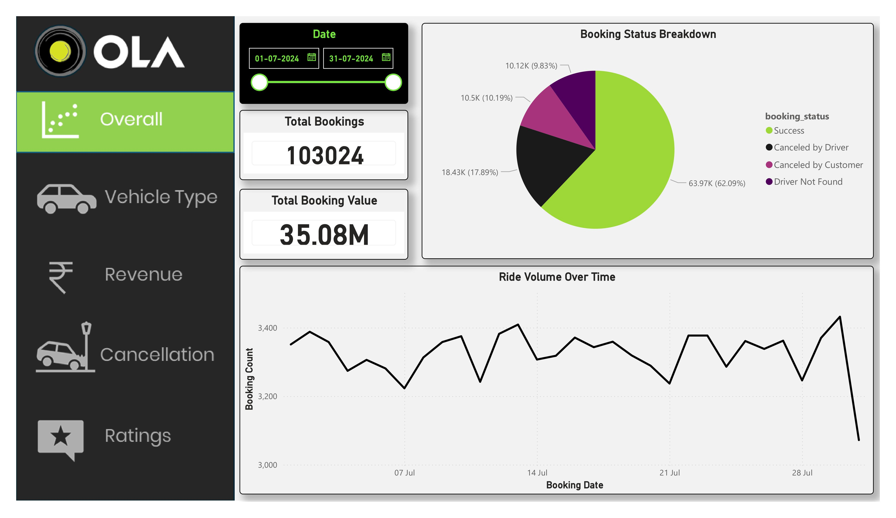
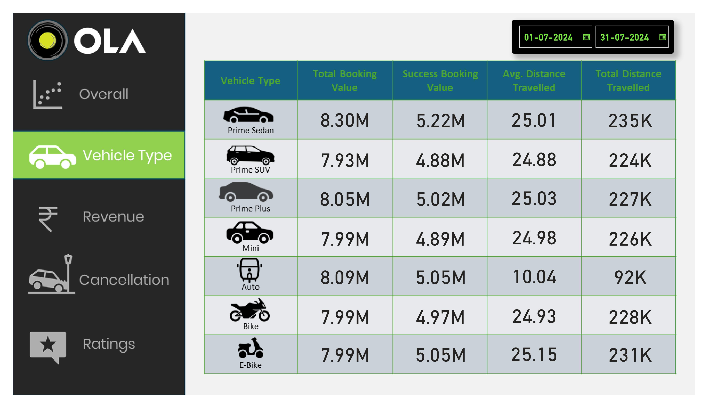
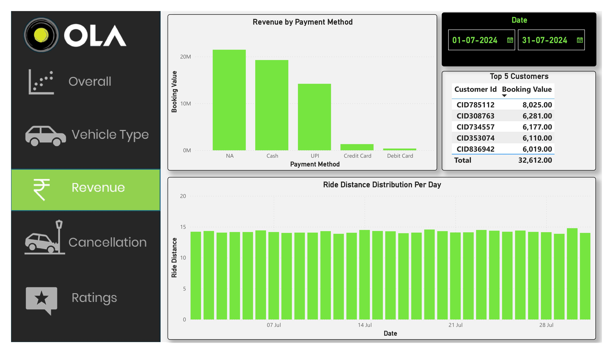
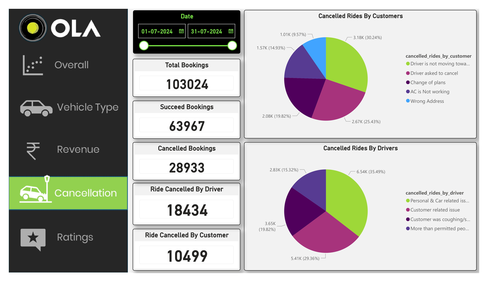
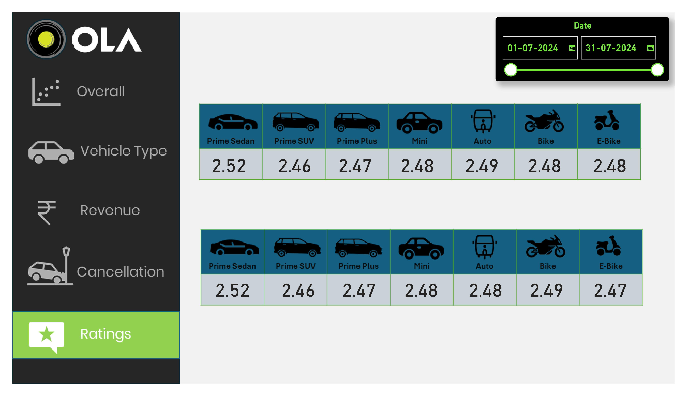

# Ola-Ride-Project

# OLA Ride Analytics Dashboard:

This project analyzes OLA ride booking data to uncover key business insights related to ride demand, cancellations, customer behavior, vehicle usage, and revenue.

The project includes SQL analysis, Power BI visualizations, and an interactive Streamlit dashboard.

---

## Project Objective:

The main objective of this project is to analyze ride booking data and extract meaningful insights that can help improve ride service operations, customer experience, and revenue optimization.

---

## Tools & Technologies Used:

- Python
- SQL (PostgreSQL)
- Power BI
- Streamlit
- Pandas
- Matplotlib
- Seaborn

---

## Project Structure:
OLA Ride Project
- app.py
- OlaBookings.csv
- requirements.txt
- README.md

---

## Key Business Questions Solved:

The analysis answers several important business questions such as:

1. Retrieve all successful bookings  
2. Find the average ride distance for each vehicle type  
3. Get the total number of cancelled rides by customers  
4. List the top 5 customers who booked the highest number of rides  
5. Get the number of rides cancelled by drivers due to personal or car issues  
6. Find the maximum and minimum driver ratings for Prime Sedan bookings  
7. Retrieve all rides where payment was made using UPI  
8. Find the average customer rating per vehicle type  
9. Calculate the total booking value of rides completed successfully  
10. List all incomplete rides along with the reason  

---

## Streamlit Dashboard Features:

The interactive Streamlit dashboard allows users to:

- Select different SQL queries
- View SQL queries used for analysis
- Display query result tables
- Visualize insights through charts and graphs
- Explore ride patterns, cancellations, and revenue insights

## You can explore the interactive dashboard here:

**Streamlit Dashboard:**  
https://ola-ride-project-hqy5unw3lym8xxhy9yvtjw.streamlit.app/

---

## How to Run the Project:

### 1️⃣ Clone the Repository
git clone https://github.com/yourusername/ola-ride-analytics.git
### 2️⃣ Navigate to Project Folder
cd ola-ride-project
### 3️⃣ Install Required Libraries
pip install -r requirements.txt
### 4️⃣ Run the Streamlit App
streamlit run app.py

---

## Power BI Dashboard:

In addition to the Streamlit dashboard, a Power BI dashboard was created to visualize:

- Ride volume trends
- Booking status breakdown
- Vehicle type performance
- Revenue insights
- Driver and customer ratings

## Power BI Dashboard Preview

---

## Key Insights:

- Certain vehicle types contribute significantly to ride distance and revenue.
- Customer cancellations impact operational efficiency.
- Driver ratings influence service quality perception.
- Digital payment methods such as UPI dominate transactions.

---

## Author

**Omkar Gawade**

Aspiring Data Analyst passionate about data analysis, visualization, and building interactive dashboards.

---

⭐ If you found this project useful, consider giving it a star!
